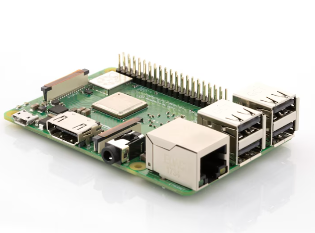
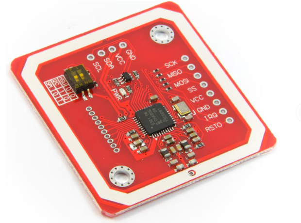

# NFC Tag Emulation with Raspberry Pi

This project demonstrates how to emulate an NFC tag using a Raspberry Pi and the PN532 NFC module. The setup uses `libnfc` to emulate NFC tags, allowing a Raspberry Pi to function as an NFC tag that can be read by devices such as smartphones.

## Project Overview

This project is designed for those interested in creating a custom NFC tag emulator using readily available hardware and software. The primary focus is on setting up a Raspberry Pi with a PN532 NFC module and using `libnfc` to handle the NFC communications. The emulator can be used to share URLs, contact information, or other data formats supported by the NFC Forum.

### Features

- **NFC Tag Emulation**: Emulates standard NFC tags, including Type 4 tags, that can be read by smartphones and other NFC-enabled devices.
- **Flexible Data Formats**: Supports a range of NDEF (NFC Data Exchange Format) records, including URLs, text, and more.
- **Customizable**: Easily modify the emulated data by creating custom NDEF files.

### Hardware Requirements

- **Raspberry Pi**: Any model with SPI support. (In my Case Raspberry Pi 3 B+)

- **PN532 NFC Module**: Capable of SPI, I2C, and HSU communication modes. This project uses the SPI interface.

- **Jumper Wires and Connectors**: For connecting the PN532 to the Raspberry Pi's GPIO pins.

### Software Requirements

- **Raspberry Pi OS**: A Linux-based operating system for the Raspberry Pi.
- **libnfc**: An open-source library to interface with NFC hardware.
- **Python 3**: Used for scripting and handling NDEF files.

## Documentation Overview

This project documentation is organized into several key sections to help you set up and use the NFC Tag Emulation with Raspberry Pi. Below is a list of what each section covers:

1. **Raspberry Pi Preparation**:
   - How to set up your Raspberry Pi, including SSH key configuration, system updates, creating a Python virtual environment, and enabling SPI.
   - [Raspberry Pi Preparation](Raspberry_Pi_Preparation/)

2. **Wiring the PN532**:
   - Detailed instructions on how to wire the PN532 NFC module to your Raspberry Pi.
   - [Wiring the PN532](Wiring_the_PN532/)

3. **Software Installation and Configuration**:
   - Instructions for activating the Python environment, installing Python and `libnfc`, and configuring everything for NFC tag emulation.
   - [Software Installation and Configuration](Installation_and_Configuration/)
