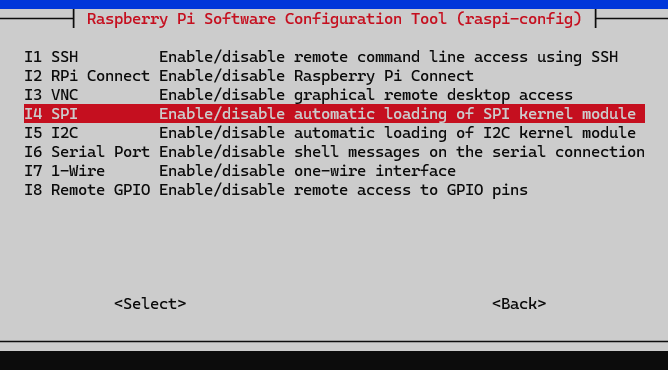

# Raspberry Pi Preparation

This guide will walk you through the necessary steps to prepare your Raspberry Pi for the NFC Tag Emulation project. This includes setting up SSH, updating the system, creating a Python virtual environment, and enabling SPI.

## Table of Contents
1. [System Update and Upgrade](#system-update-and-upgrade)
2. [Setting Up SSH Keys](#Setting-Up-SSH-Keys)
3. [Creating a Python Virtual Environment](#creating-a-python-virtual-environment)
4. [Enabling SPI](#enabling-spi)

## System Update and Upgrade

Ensure your Raspberry Pi is running the latest software by following these steps:

1. Update the package list:
   ```bash
   sudo apt-get update
2. Upgrade all installed packages:
   ```bash
   sudo apt-get upgrade -y
3. Reboot the Raspberry Pi:
   ```bash
   sudo reboot

## Setting Up SSH Keys

To securely access your Raspberry Pi via SSH using key-based authentication, follow these steps:

### 1. Install Git on Your Windows Laptop

If you don't already have Git installed, download and install it from the [official Git website](https://git-scm.com/downloads). Git comes with an integrated SSH client, which we'll use to generate SSH keys.

### 2. Generate SSH Keys on Windows

1. Open Git Bash (installed with Git) on your Windows laptop.
2. Generate a new SSH key pair by running the following command:
   ```bash
   ssh-keygen -t rsa -b 4096 -C "your_email@example.com"
   When prompted, specify a file to save the key (e.g., C:\Users\YourName\.ssh\id_rsa).
   Enter a passphrase when prompted (optional).
3. Your public key will be saved in a file ending in .pub (e.g., id_rsa.pub), and the private key will be saved without an extension (e.g., id_rsa).
   
### 3. Prepare the Raspberry Pi for SSH Key Authentication

1. Connect to your Raspberry Pi using the default username and password (you can use a temporary password-based SSH connection for this step):
2. Create the .ssh directory in the home directory (if it doesn’t already exist):
   ```bash
   mkdir -p ~/.ssh
3. Set the correct permissions for the .ssh directory:
   ```bash
   chmod 700 ~/.ssh
4. Create the authorized_keys File where the Public Keys are going to be stored:
   ```bash
   touch authorized_keys
5. Copy your Public Key in the new create authorized_keys File (Pulic Key File is named id_rsa.pub):
   ```bash
   nano authorized_keys
6. Ensure the authorized_keys file has the correct permissions:
   ```bash
   chmod 600 ~/.ssh/authorized_keys

If everything is set up correctly, you should be able to connect without enetering a password (If you set a Passphrase, then you will be prompted to enter the passphrase)

### Creating a Python Virtual Environment

To keep your project dependencies isolated, it’s recommended to use a Python virtual environment. Follow these steps to set it up:

1. **Install the `python3-venv` package** (if it’s not already installed):
   ```bash
   sudo apt-get install python3-venv -y
2. Create a virtual environment:
Navigate to the directory where you want to create the virtual environment, then run:
    ```bash
    python3 -m venv newenv
3. Activate the virtual environment:
To activate the virtual environment, use the following command:
    ```bash
    source newenv/bin/activate
Once activated, your command prompt will change to indicate that you’re working within the virtual environment (it will show (newenv) before your command prompt).

After activating the virtual environment, you can install necessary Python packages.

### Deactivating the Virtual Environment

- When you’re done working, you can deactivate the virtual environment by simply running:
    ```bash
    deactivate

Using a virtual environment ensures that your project has its own set of dependencies that won’t interfere with other Python projects on the same system. This makes it easier to manage project-specific requirements and maintain a clean working environment.

## Enabling SPI

The PN532 module communicates with the Raspberry Pi via SPI, so you need to enable the SPI interface on your Raspberry Pi. Follow these steps to enable SPI:

1. **Open the Raspberry Pi configuration tool**:
   ```bash
   sudo raspi-config
2. Navigate to Interface Options:
In the raspi-config menu, use the arrow keys to navigate to Interface Options and press Enter.
3. Select SPI:
In the Interface Options menu, select SPI and press Enter.

4. Enable SPI:
When prompted, choose Yes to enable the SPI interface.
5. Exit the configuration tool:
After enabling SPI, exit the raspi-config tool by selecting Finish.
6. Reboot the Raspberry Pi:
To apply the changes, reboot your Raspberry Pi:
    ```bash
    sudo reboot

### Verifying SPI is Enabled

- After rebooting, you can verify that SPI is enabled by listing the available SPI devices:
    ```bash
    ls /dev/spi*
- The Output should look something like this:
    ```bash
    /dev/spidev0.0  /dev/spidev0.1