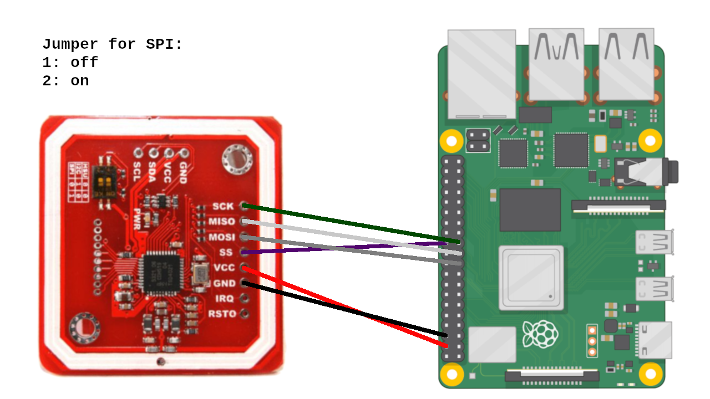

# Wiring the PN532 to the Raspberry Pi

This guide explains how to wire the PN532 NFC module to a Raspberry Pi using the SPI interface. Proper wiring is essential to ensure reliable communication between the Raspberry Pi and the PN532.

## Table of Contents

- [Wiring the PN532 to the Raspberry Pi](#wiring-the-pn532-to-the-raspberry-pi)
  - [Table of Contents](#table-of-contents)
  - [Required Hardware](#required-hardware)
  - [Pin Mapping](#pin-mapping)
  - [Wiring Instructions](#wiring-instructions)
  - [Verifying the Connection](#verifying-the-connection)

## Required Hardware

- **Raspberry Pi**: Any model with SPI support (e.g., Raspberry Pi 3 B+).
- **PN532 NFC Module**: Capable of SPI, I2C, and HSU communication modes. This guide covers the SPI interface.
- **Jumper Wires**: For making connections between the Raspberry Pi GPIO pins and the PN532 module.
- **Breadboard (Optional)**: Useful for making temporary connections.

## Pin Mapping

Below is the pin mapping between the Raspberry Pi GPIO pins and the PN532 NFC module for SPI communication:

| PN532 Pin | Label  | Raspberry Pi Pin | GPIO Pin Name  |
|-----------|--------|------------------|----------------|
| VCC       | VCC    | 2 (5V)           | 5V             |
| GND       | GND    | 6 (GND)          | Ground (GND)   |
| SCK       | SCK    | 23 (GPIO11)      | SCLK (SPI0_SCLK)|
| MISO      | MISO   | 21 (GPIO9)       | MISO (SPI0_MISO)|
| MOSI      | MOSI   | 19 (GPIO10)      | MOSI (SPI0_MOSI)|
| SS        | NSS    | 24 (GPIO8)       | CE0 (SPI0_CE0_N)|
| RSTO      | RSTPDN | (Optional)       | Reset Pin (optional)|
| IRQ       | IRQ    | (Optional)       | Interrupt Pin (optional)|

## Wiring Instructions

Follow these steps to wire the PN532 NFC module to the Raspberry Pi:

1. **Power Connections**:
   - Connect the VCC pin on the PN532 to the 5V pin on the Raspberry Pi.
   - Connect the GND pin on the PN532 to a GND pin on the Raspberry Pi.

2. **SPI Connections**:
   - Connect the SCK (SCLK) pin on the PN532 to the SCLK (GPIO11) pin on the Raspberry Pi.
   - Connect the MISO pin on the PN532 to the MISO (GPIO9) pin on the Raspberry Pi.
   - Connect the MOSI pin on the PN532 to the MOSI (GPIO10) pin on the Raspberry Pi.
   - Connect the SS (NSS) pin on the PN532 to the CE0 (GPIO8) pin on the Raspberry Pi.

3. **Switching to SPI Mode**:
   - Ensure that your PN532 module is switched to SPI mode. Many PN532 modules have a physical switch or jumper settings that you need to adjust to enable SPI communication.



## Verifying the Connection

Once you've completed the wiring, you can verify that the PN532 module is correctly connected to the Raspberry Pi:

1. **Ensure SPI is Enabled**:
Make sure SPI is enabled on your Raspberry Pi. If it’s not, refer to the [Enabling SPI](../Raspberry_Pi_Preparation/README.md) section of the installation guide.

1. **Check for Connected Devices**:
Use the following command to check if the Raspberry Pi detects the PN532 module:
    ```bash
    ls /dev/spi*
You should see /dev/spidev0.0 and /dev/spidev0.1 in the output if SPI is enabled and working.
2. Run a Basic Test:
Use a simple Python script or a tool like nfc-list to verify communication with the PN532
    ```bash
    nfc-list
If everything is connected correctly, the PN532 module should be detected.
